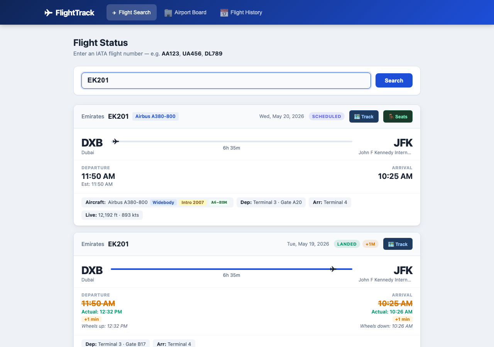

# FlightTrack

A real-time flight status and tracking app built with React and Node.js, powered by the [AviationStack API](https://aviationstack.com/).

  



## Features

- **Flight Search** — Look up any flight by IATA code (e.g. `EK201`, `LH400`) and see real-time status, departure/arrival times, delays, and gate info
- **Aircraft Details** — Full aircraft name, type classification (Widebody / Narrowbody / Regional / Turboprop), type introduction year, and tail registration number
- **Codeshare Info** — When a flight is operated under a partner airline's code (e.g. DL8400 operated as AF1240 by Air France), the codeshare relationship is shown on the card
- **Runway Times** — Wheels-up and wheels-down times shown alongside gate departure/arrival times when available from the API
- **Seat Map View** — Click 🪑 Seats on any card to open a cabin layout modal showing First, Business, Premium Economy, and Economy sections with correct aisle configurations, row numbers, seat letters, and exit row indicators. Covers 35+ aircraft types
- **Airport Board** — View all departures or arrivals for any airport by IATA code
- **Flight History** — Look up past flights by date (requires AviationStack paid plan)
- **Live Map** — Click 🗺 Track to open an interactive great-circle route map with real-time aircraft position, altitude, and speed
- **Flight Progress** — Visual progress bar showing how far along the route a flight is

## Tech Stack

| Layer | Technology |
|---|---|
| Frontend | React 18, Vite |
| Mapping | Leaflet.js |
| Backend | Express.js (API proxy) |
| Data | AviationStack REST API |

## Getting Started

### Prerequisites

- Node.js 18+
- An [AviationStack API key](https://aviationstack.com/) (free tier works for live flight search)

### Setup

```bash
# Clone the repo
git clone https://github.com/amitgawali25/flight-status-app.git
cd flight-status-app

# Install dependencies
npm install

# Configure your API key
cp .env.example .env
# Edit .env and set AVIATIONSTACK_API_KEY=your_key_here

# Start the app (runs both Vite dev server and Express proxy)
npm run dev
```

The app will be available at `http://localhost:5173` (or the next available port).

### Environment Variables

| Variable | Description |
|---|---|
| `AVIATIONSTACK_API_KEY` | Your AviationStack API key |
| `PORT` | Port for the Express proxy server (default: `3001`) |

## Usage

1. **Search a flight** — Enter an IATA flight number like `EK201` or `LH400` and hit Search
2. **View details** — Each card shows route, times, delays, terminal/gate, aircraft type, registration, codeshare info, and runway times
3. **View seat map** — Click 🪑 Seats to see the cabin layout for the aircraft type
4. **Track on map** — Click 🗺 Track to open the interactive route map
5. **Airport board** — Switch to the Airport Board tab, enter an airport code (e.g. `JFK`), and toggle between Departures and Arrivals

## Project Structure

```
src/
├── api/
│   └── flightApi.js          # AviationStack API client
├── components/
│   ├── FlightCard.jsx         # Main flight display card
│   ├── FlightMap.jsx          # Interactive Leaflet map
│   ├── SeatMapModal.jsx       # Cabin seat layout modal
│   ├── FlightSearch.jsx       # Flight number search
│   ├── AirportSearch.jsx      # Airport departures/arrivals
│   ├── FlightHistory.jsx      # Historical flight lookup
│   └── StatusBadge.jsx        # Status indicator badge
├── data/
│   ├── aircraft.js            # IATA aircraft type → name/category/intro year lookup
│   ├── seatmaps.js            # Aircraft cabin layout configs (35+ types)
│   └── airports.js            # IATA airport → coordinates lookup
└── App.jsx                    # Tab navigation root
server.js                      # Express proxy (keeps API key server-side)
```

## Notes

- The free AviationStack plan supports real-time flight search but not historical data
- Aircraft type data (`aircraft.iata`) is not populated by AviationStack for all flights — aircraft details and seat map buttons are omitted gracefully when unavailable
- Seat maps show typical cabin configurations for each aircraft type; actual airline configurations vary
- The live position shown on the map is interpolated when real-time GPS data is unavailable
